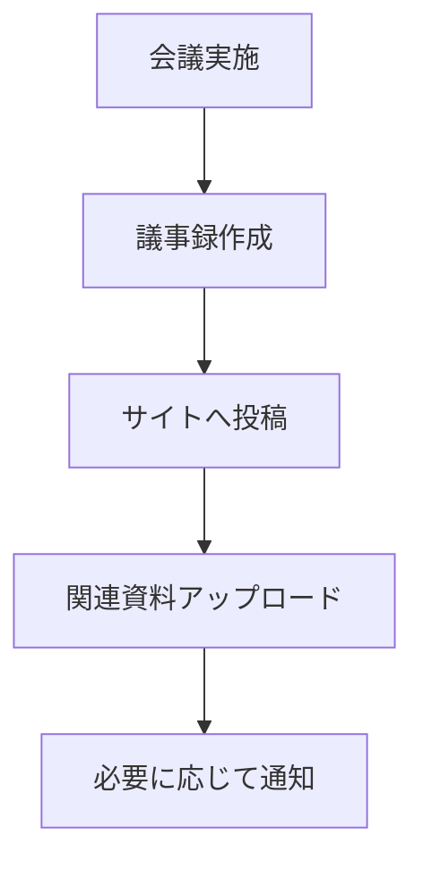

# 更新作業

このページでは、社会連携講座サイトの更新作業について説明します。

## 基本的な更新フロー



## 議事録投稿の標準手順

### ステップ1: 事前準備
1. **会議資料の収集**
   - 配布資料のPDF化
   - 写真・図表の整理
   - 参考URLの確認

2. **投稿ファイル名の決定**
   ```
   2025-06-25-第5回定例会議議事録.md
   ```

### ステップ2: GitHub での投稿作成
1. **_posts フォルダ**にアクセス
2. **Create new file** をクリック
3. ファイル名を入力
4. [議事録テンプレート](templates#議事録テンプレート)を使用

### ステップ3: 内容の記入
```markdown
---
layout: post
---

# 第5回 社会連携講座定例会議

## 会議概要
| 項目 | 内容 |
|------|------|
| 日時 | 2025年6月25日 14:00-16:00 |
| 場所 | 第1会議室 |
| 議長 | 田中教授 |
| 参加者 | 田中、佐藤、鈴木、山田 |

## 議事内容
（ここに会議の詳細を記載）

## 決定事項
1. 次回予算会議を7月15日に開催
2. 研修プログラムの内容を見直し

## アクションアイテム
- [ ] 田中: 予算資料準備（7/10まで）
- [ ] 佐藤: 外部講師との調整（7/5まで）
```

### ステップ4: 関連ファイルのアップロード
1. **会議資料のPDF**
   - [GitHub Releases](file-management#github-releases-でのpdf管理) でアップロード
   - 議事録内でリンク

2. **図表・写真**
   - `assets/images/` フォルダにアップロード
   - 適切なファイル名で保存

### ステップ5: 投稿の公開
1. **Commit changes** でファイルを保存
2. **5分後**にサイトに反映確認
3. **トップページ**で一覧表示を確認

## GitHub Releases での報告書管理

### 月次報告書のアップロード手順

#### ステップ1: 報告書の準備
1. **PDFファイルの作成**
   - ファイル名: `monthly-report-2025-06.pdf`
   - ファイルサイズ: 25MB 以下

2. **添付資料の整理**
   - 関連する図表・データ
   - 補足資料

#### ステップ2: Release の作成
1. **Releases ページ**にアクセス
2. **Create a new release** をクリック
3. **Release 情報の入力**：
   ```
   Tag version: monthly-2025-06
   Release title: 2025年6月 月次活動報告
   Description:
   ## 概要
   2025年6月の活動報告書です。
   
   ## 主な内容
   - 定例会議3回の議事録
   - プロジェクト進捗状況
   - 次月の予定
   
   ## 添付ファイル
   - monthly-report-2025-06.pdf（本体）
   - appendix-budget-2025-06.pdf（予算資料）
   ```

#### ステップ3: ファイルのアップロード
1. **Attach binaries** エリアにPDFをドラッグ
2. **複数ファイル**の同時アップロード可能
3. **Upload 完了**を確認

#### ステップ4: 公開とリンク作成
1. **Publish release** をクリック
2. **URL をコピー**
3. **publications.md** ページにリンクを追加：
   ```markdown
   | 2025年6月 | 月次活動報告 | [PDF](https://github.com/user/repo/releases/download/monthly-2025-06/monthly-report-2025-06.pdf) |
   ```


## 複数人での管理体制

### 役割分担の例
| 役割 | 担当者 | 主な作業 |
|------|--------|----------|
| **サイト管理者** | 事務局長 | 全体統括、設定変更 |
| **コンテンツ編集者** | 事務局員 | 日常の投稿・更新 |
| **資料管理者** | 各プロジェクト担当 | PDF・画像のアップロード |

### GitHub での権限管理
1. **Settings** → **Manage access**
2. **Collaborators** の追加
3. **Role** の設定：
   - **Admin**: 全権限
   - **Write**: 編集権限
   - **Read**: 閲覧のみ

### 編集競合の回避
```markdown
# 編集前の確認事項
1. 他の人が編集中でないか確認
2. 大きな変更は事前に相談
3. 同じファイルの同時編集は避ける
```

## バックアップとリカバリ

### 自動バックアップ
- **GitHub の特徴**: すべての変更履歴が自動保存
- **リビジョン管理**: 過去の任意の状態に復元可能
- **ブランチ機能**: 安全な実験・テスト環境

### 復元手順
1. **履歴の確認**
   - ファイルの **History** タブをクリック
   - 復元したいバージョンを選択

2. **ファイルの復元**
   - **Revert changes in pull request** をクリック
   - または古いバージョンをコピー&ペースト

### 定期的なローカルバックアップ
```bash
# Git クローンによるローカル保存（上級者向け）
git clone https://github.com/username/repository.git
```

## トラブル対応手順

### 緊急時の対応フロー
1. **問題の特定**
   - サイトが表示されない
   - 特定のページでエラー
   - ファイルが見つからない

2. **一時的な対処**
   - 問題のあるファイルを一時的に削除
   - または前のバージョンに復元

3. **根本的な解決**
   - 原因の調査
   - 設定ファイルの確認
   - 必要に応じて専門家に相談

### よくある問題と対処法
| 問題 | 原因 | 対処法 |
|------|------|--------|
| サイトが真っ白 | _config.yml エラー | 設定ファイルを前のバージョンに復元 |
| 画像が表示されない | ファイルパスミス | パスの確認・修正 |
| 投稿が表示されない | ファイル名の形式エラー | 正しい命名規則で再作成 |


## 応用編: ローカル環境での編集・開発

<div style="background-color: #fff3e0; padding: 15px; border-radius: 5px; margin: 15px 0;">
<strong>🎯 対象読者</strong><br>
• より効率的な編集環境を求める方<br>
• 大量のファイル編集を行う方<br>
• オフライン環境での作業が必要な方<br>
• 高度なGit機能を活用したい方
</div>

### ローカル編集とは？

**従来のFTPでのWebページ更新**との対比で理解すると：

| 項目 | FTP方式 | Git/GitHub方式 |
|------|---------|---------------|
| **編集環境** | ローカルエディタ → FTPアップロード | ローカルエディタ → Git push |
| **プレビュー** | ローカルサーバーで確認 | Jekyll serve で確認 |
| **ファイル管理** | 手動でファイル同期 | Git による自動バージョン管理 |
| **協働作業** | ファイル上書きリスク | ブランチ・マージによる安全な統合 |
| **履歴管理** | 手動バックアップ | 全変更履歴の自動保存 |

### ローカル環境のメリット

1. **高機能エディタの使用**
   - VSCode、Atom等での効率的な編集
   - リアルタイム文法チェック
   - 複数ファイルの一括検索・置換

2. **オフライン作業**
   - インターネット接続不要で編集可能
   - 大量のファイル編集が高速

3. **詳細なプレビュー**
   - 実際のサイトと同一の表示確認
   - デザイン調整の即座確認

### ローカル環境セットアップ

詳細な手順は公式ドキュメントを参照してください：
**[GitHub Pages サイトを Jekyll でローカルにテストする](https://docs.github.com/ja/pages/setting-up-a-github-pages-site-with-jekyll/testing-your-github-pages-site-locally-with-jekyll)**

#### 社会連携講座サイト特有の補足事項

**1. CommonMarkGhPages の設定確認**
```bash
# Gemfile に以下が含まれていることを確認
gem 'commonmarker'
gem 'jekyll-commonmark-ghpages'
```

**2. 日本語ファイル名の対応**
Windows環境では投稿ファイル名（`2025-06-25-第5回会議.md`）で文字化けが発生する場合があります：

```bash
# Git の設定で回避
git config core.quotepath false
git config gui.encoding utf-8
git config i18n.logoutputencoding utf-8
```

**3. プレビュー時の注意点**
```bash
# ローカルサーバー起動
bundle exec jekyll serve

# 日本語URL対応のため、以下のオプションを推奨
bundle exec jekyll serve --force_polling --livereload
```

### ローカルでの日常運用フロー

#### 基本的な編集フロー
```bash
# 1. 最新状態を取得
git pull origin main

# 2. ファイル編集
# （VSCode等で議事録を作成）

# 3. ローカルでプレビュー確認
bundle exec jekyll serve

# 4. 変更をコミット
git add .
git commit -m "Add meeting minutes for 2025-06-25"

# 5. GitHub にプッシュ
git push origin main
```

#### 大量編集時の効率的手順
```bash
# 複数ファイルの一括作成・編集
# （テンプレートから複数議事録を作成など）

# 変更をまとめてコミット
git add _posts/*.md
git commit -m "Add multiple meeting minutes for Q1"

# 一括プッシュ
git push origin main
```

### ローカル環境での画像・PDF管理

#### assets/images の効率的な管理
```bash
# 画像ファイルの一括追加
cp ~/Downloads/*.png assets/images/
git add assets/images/
git commit -m "Add seminar photos"
```

#### GitHub Releases へのファイル準備
```bash
# PDF等をローカルで整理してからWeb経由でアップロード
mkdir release-files/monthly-2025-06/
cp ~/Documents/reports/*.pdf release-files/monthly-2025-06/
# ← その後 GitHub の Web UI で Releases にアップロード
```

### ローカル環境でのトラブルシューティング

#### よくある問題と解決法

**Jekyll サーバーが起動しない**
```bash
# Gemのバージョン確認
bundle list

# キャッシュのクリア
bundle exec jekyll clean
bundle exec jekyll serve
```

**文字エンコーディングエラー（Windows）**
```bash
# 環境変数を設定
set RUBYOPT=-EUTF-8
bundle exec jekyll serve
```

**ライブリロードが機能しない**
```bash
# ポーリング方式に変更
bundle exec jekyll serve --force_polling --livereload
```

### チーム開発での注意事項

#### コンフリクト回避のベストプラクティス
- **同一ファイルの同時編集を避ける**
- **作業前に必ず `git pull` を実行**
- **小さな単位で頻繁にコミット**

### Web編集との使い分け

| 作業内容 | 推奨方法 | 理由 |
|----------|----------|------|
| **簡単な議事録投稿** | Web編集 | 手軽で即座に反映 |
| **複数ページの大幅更新** | ローカル編集 | 効率的な一括編集 |
| **設定ファイルの変更** | ローカル編集 | 文法チェック・安全性 |
| **デザインの調整** | ローカル編集 | リアルタイムプレビュー |
| **緊急の修正** | Web編集 | 迅速な対応 |

---

**次のステップ**: [トラブルシューティング](troubleshooting) で問題解決方法を学びましょう。